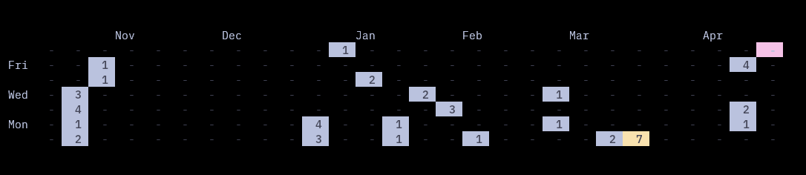

# GoGitStat

A simple program to visualize git contributions on the command-line.

## Usage

First, add repositories where the contributions should be counted:

`go run main -add "/path/to/your/repo"`

You can add as many as you prefer.

Then, visualize the contributions by a given author:

`go run main -email "youremail@domain.com"`

## Notes

The added repository locations are saved in a config file at `~/.config/.gostat`
